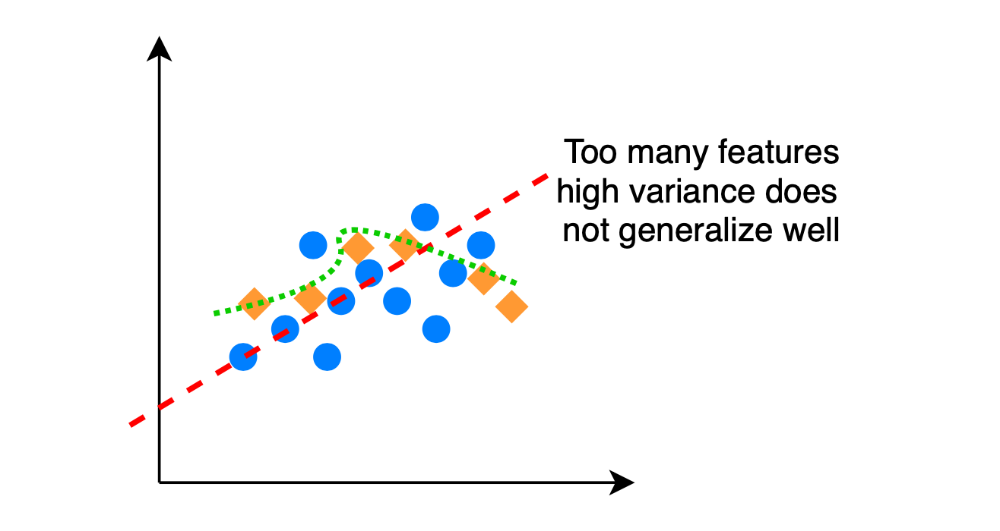
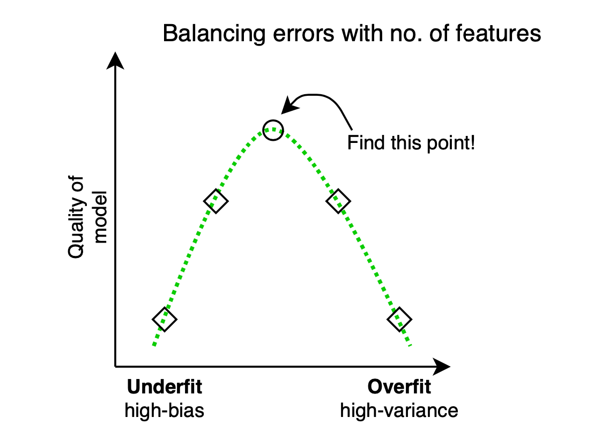
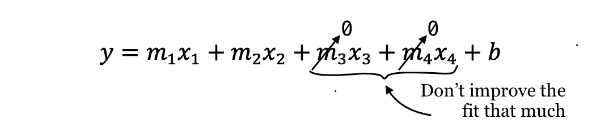

# Feature Selection

Feature Selection | Example code and own notes while taking the course "Intro to Machine Learning" on Udacity.

> Make everything as simple as possible, but no simpler.

⭐️ **"as simple as possible"** 👉select best features

⭐️ **"no simpler"** 👉add new features

## Addign a new feature:
- Use my human intuition
- Code up the new feature
- Visualize
- Repeat

## Features ≠ Information

Features 👉quantity (Attemt to access information)

Information 👉quality (We want this!)

## Univariate Feature Selection (in sklearn)
1. `SelectPercentile`: Selects the X% of features that are most powerful.
2. `SelectKBest`: Selects the K features that are most powerful.

## Example using TfIdfVectorizer

```python
max_df = 0.5
```
That means; words with a document frequency of more than 0.5 will be removed.

This argument says: do not use it in tfidf, because it probaly does not contain lot of information in it, because it is so common.

## Bias - variance dilemma and number of features

|HIGH BIAS|HIGH VARIANCE|
|---|---|
|Pays little attention to data|Pays too much attention to data (does not generalize well)|
|Over simplified|Overfits|
|High error on training set (low r², large SSE)|Much higher error on test set than on training set|
|Few features used|Many features, carefully optimized performance on training data|

⭐️**Sweet spot** ⭐ Few features, large r²/low SSE

## An overfit regression


## Regularization


### Regularization in Regression
Method for "automatically penalizing extra features".

## Lasso Regression
Minimize `SSE + λ|β|`

- SSE: errors
- β: coefficients of regression
- λ|β|: no. of features



- m's: coefficients of regression
- x's: features

## Sklearn / Lasso

```python
from sklearn.linear_model import Lasso 

regression = Lasso()
regression.coef_
> [0.7, 0.0] # That means, we have 2 features and the first one matters!
```
